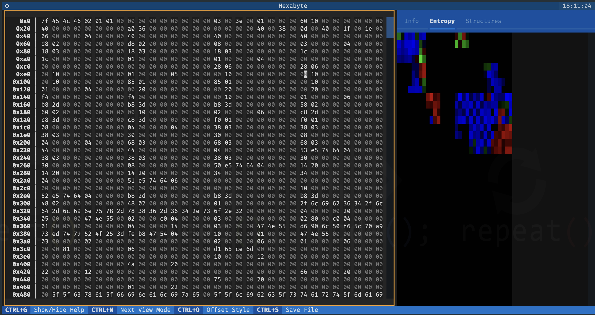
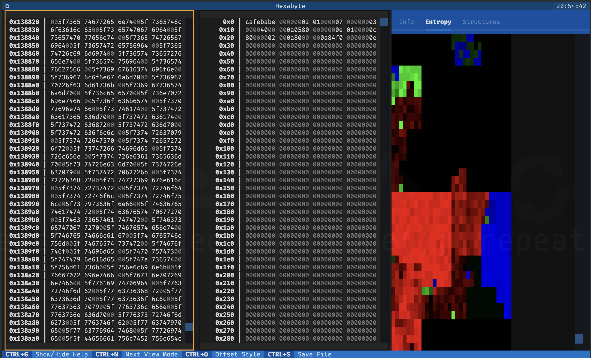

# Hexabyte Extended Info Plugin

[](https://pypi.python.org/pypi/hexabyte_entropy)
[](https://pypi.python.org/pypi/hexabyte_entropy)
[](https://pypi.org/project/hexabyte_entropy/)
[](https://pypi.python.org/pypi/hexabyte_entropy)
[](https://pypi.python.org/pypi/hexabyte_entropy)
[](https://pypi.org/project/hexabyte_entropy/)
[](https://pypi.org/project/hexabyte_entropy/)

[](https://github.com/thetacom/hexabyte_entropy/actions/)
[](https://github.com/thetacom/hexabyte_entropy/actions/)
[](https://github.com/thetacom/hexabyte_entropy/actions/)
[](https://github.com/thetacom/hexabyte_entropy/actions/)

[](https://github.com/pre-commit/pre-commit)
[](https://github.com/charliermarsh/ruff)

A hexabyte plugin for displaying the entropy of file chunks.

The entropy values are mapped to color codes and then displayed in a scrollable sidebar. Clicking on a chunk will jump the active editor to the location of the selected chunk.

## User

### Install

```bash
~/$ pip install hexabyte-entropy
...
```

Add `hexabyte_entropy` to the plugins list inside your hexabyte config (`~/.config/hexabyte/config.toml`).

```toml
plugins = [ "hexabyte_entropy",]
```

## x86_64 Hello World



## MacOS Bash



## Developer

```bash
~/$ git clone https://github.com/thetacom/hexabyte_entropy
...
~/$ cd hexabyte_entropy
hexabyte_entropy/$ poetry install
...
```

### Test

```bash
hexabyte_entropy/$ make test
...
```
